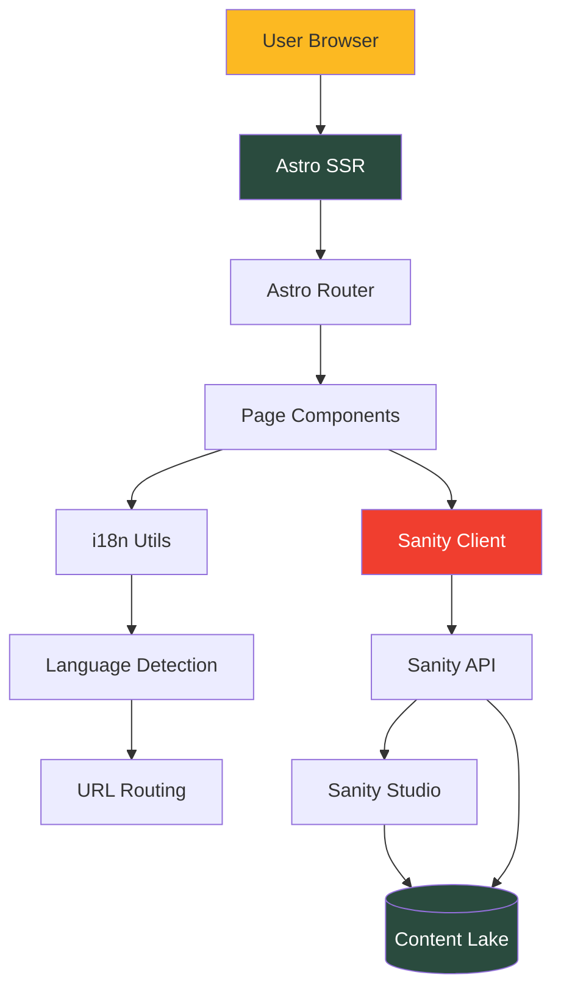

Del Poble Pizzeria is built with a modern headless CMS architecture that combines Astro's server-side rendering capabilities with Sanity's flexible content management system.

## Tech Stack

The project uses the following core technologies:

<CardGroup cols={2}>
  <Card title="Astro" icon="rocket">
    Server-side rendering framework with hybrid static/dynamic capabilities
  </Card>
  <Card title="Sanity CMS" icon="database">
    Headless content management system with real-time editing
  </Card>
  <Card title="Vercel" icon="cloud">
    Serverless deployment platform with edge functions
  </Card>
  <Card title="SASS" icon="paintbrush">
    CSS preprocessor for styling
  </Card>
</CardGroup>

## Astro SSR Configuration

The site is configured for **server-side rendering (SSR)** to enable dynamic content delivery and internationalization.

<CodeGroup>

```javascript astro.config.mjs
import { defineConfig } from 'astro/config';
import vercel from '@astrojs/vercel';

export default defineConfig({
  output: 'server', // Enable server-side rendering
  adapter: vercel(),
  i18n: {
    defaultLocale: 'es',
    locales: ['es', 'en', 'val'],
    routing: {
      prefixDefaultLocale: false, // Spanish at root: /
    }
  },
});
```

```json package.json
{
  "name": "delpoblepizzeria",
  "type": "module",
  "dependencies": {
    "@astrojs/vercel": "^9.0.4",
    "@sanity/client": "^7.14.0",
    "@sanity/image-url": "^2.0.3",
    "astro": "^5.17.1",
    "astro-portabletext": "^0.13.0",
    "gsap": "^3.14.2",
    "lenis": "^1.3.17"
  }
}
```

</CodeGroup>

### Why SSR?

<AccordionGroup>
  <Accordion title="Dynamic Internationalization">
    SSR enables runtime language detection and content localization without pre-building every language variant.
  </Accordion>
  
  <Accordion title="Server Actions">
    Form submissions and API interactions are handled server-side for better security and performance.
  </Accordion>
  
  <Accordion title="Real-time Content">
    Content updates from Sanity can be reflected immediately without rebuilding the site.
  </Accordion>
</AccordionGroup>

## Project Structure

```bash
delpoblepizzeria/
├── src/
│   ├── components/          # Astro components
│   │   ├── Head.astro
│   │   ├── Header.astro
│   │   ├── Footer.astro
│   │   └── Section*.astro
│   ├── i18n/                # Internationalization
│   │   ├── ui.ts           # UI translations
│   │   └── utils.ts        # i18n utilities
│   ├── layouts/            # Page layouts
│   │   └── Layout.astro
│   ├── lib/                # Utilities and integrations
│   │   ├── sanity.ts       # Sanity client setup
│   │   └── sanityQueries.ts # GROQ queries
│   ├── pages/              # File-based routing
│   │   ├── index.astro     # Spanish (default)
│   │   ├── en/
│   │   │   └── index.astro # English
│   │   └── val/
│   │       └── index.astro # Valencià
│   └── styles/             # SCSS stylesheets
│       └── global.scss
│
├── delpoble-studio/        # Sanity Studio
│   ├── schemas/            # Content schemas
│   │   ├── index.ts
│   │   ├── languages.ts
│   │   ├── localized.ts
│   │   ├── frontPage.ts
│   │   └── *.ts
│   └── sanity.config.ts    # Studio configuration
│
└── astro.config.mjs        # Astro configuration
```

## Architecture Diagram



## Sanity Integration

### Client Setup

The Sanity client is configured to fetch content from the Sanity API:

```typescript src/lib/sanity.ts
import { createClient } from '@sanity/client';

export const client = createClient({
  projectId: 'v8qkjh2b',
  dataset: 'production',
  useCdn: true,
  apiVersion: '2024-01-01',
});
```

### Data Flow

1. **User requests a page** (e.g., `/en/carta`)
2. **Astro detects language** from URL path
3. **Page component** executes GROQ query with language parameter
4. **Sanity API** returns localized content
5. **Astro renders** the page with content
6. **HTML sent** to user's browser

<Note>
  All content queries happen at **request time** (SSR), not build time. This allows for instant content updates without redeployment.
</Note>

## Page Rendering Pattern

Every page follows this pattern:

```astro src/pages/index.astro
---
import Layout from '../layouts/Layout.astro';
import { client } from '../lib/sanity';
import { getFrontPageQuery } from '../lib/sanityQueries';
import { getLangFromUrl } from '../i18n/utils';

// 1. Detect language from URL
const lang = getLangFromUrl(Astro.url);

// 2. Fetch localized content from Sanity
const frontPageData = await client.fetch(getFrontPageQuery(lang));
---

<Layout>
  <main>
    <!-- 3. Render components with localized data -->
    <Head
      backgroundImages={frontPageData.backgroundImages}
      orderLink={frontPageData.orderLink}
      marqueeText={frontPageData.marqueeText}
    />
  </main>
</Layout>
```

## Key Features

### File-based Routing

Astro uses file-based routing where the directory structure maps to URLs:

- `src/pages/index.astro` → `/` (Spanish)
- `src/pages/en/index.astro` → `/en/` (English)
- `src/pages/val/carta.astro` → `/val/carta` (Valencià menu)

### Server Actions

<Info>
  The `output: 'server'` configuration enables server-side API endpoints for form submissions, email sending, and other backend operations.
</Info>

### Component Architecture

Components are organized by function:

- **Layout components**: Provide consistent page structure
- **Section components**: Reusable page sections (SectionTwo, SectionThree, etc.)
- **UI components**: Buttons, forms, navigation

## Deployment

The site deploys to Vercel with automatic deployments on git push:

<Steps>
  <Step title="Build Process">
    Vercel runs `astro build` to prepare the SSR bundle
  </Step>
  <Step title="Edge Functions">
    Each route becomes a serverless function at the edge
  </Step>
  <Step title="CDN Distribution">
    Static assets are distributed globally via Vercel's CDN
  </Step>
</Steps>

## Performance Considerations

<CardGroup cols={2}>
  <Card title="Edge Rendering" icon="bolt">
    Pages are rendered at the edge, close to users for minimal latency
  </Card>
  <Card title="Image Optimization" icon="image">
    Sanity's image CDN automatically optimizes images
  </Card>
  <Card title="Code Splitting" icon="scissors">
    Astro automatically splits JavaScript bundles per route
  </Card>
  <Card title="CSS Scoping" icon="lock">
    Component-scoped CSS prevents style conflicts and reduces bundle size
  </Card>
</CardGroup>

## Related Documentation

<CardGroup cols={2}>
  <Card title="Internationalization" icon="globe" href="/concepts/internationalization">
    Learn how the i18n system works
  </Card>
  <Card title="Sanity CMS" icon="database" href="/concepts/sanity-cms">
    Understanding content schemas and Studio setup
  </Card>
</CardGroup>
