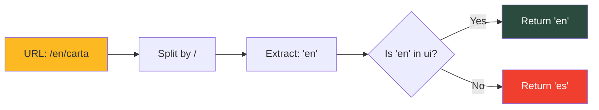
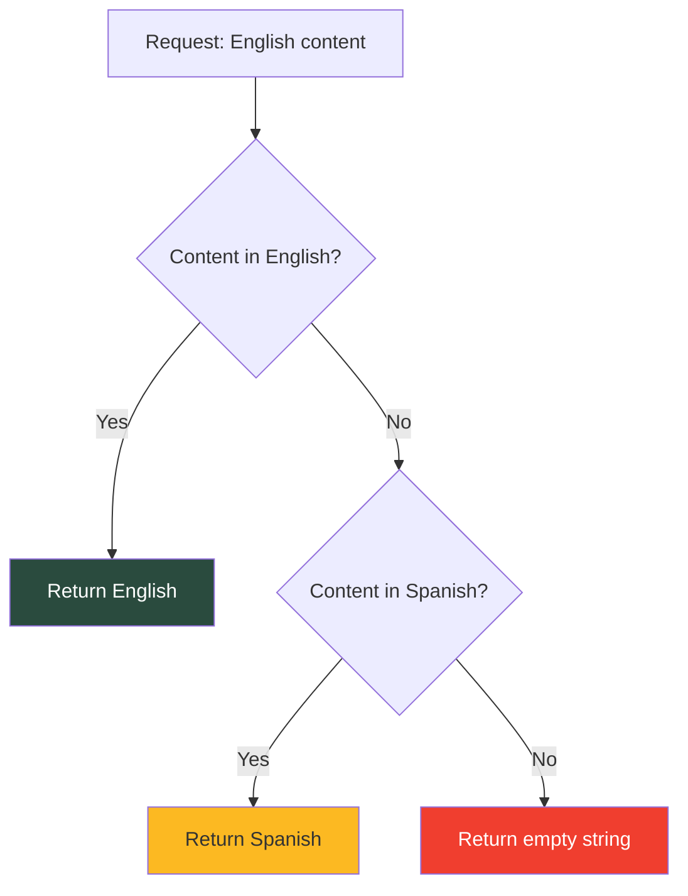

Del Poble Pizzeria supports three languages: **Español (ES)**, **English (EN)**, and **Valencià (VAL)** using a hybrid i18n system that combines Astro's routing with Sanity's localized content.

## Supported Languages

<CardGroup cols={3}>
  <Card title="Español" icon="🇪🇸">
    Default language, no URL prefix
  </Card>
  <Card title="English" icon="🇬🇧">
    Prefixed with `/en/`
  </Card>
  <Card title="Valencià" icon="valencia">
    Prefixed with `/val/`
  </Card>
</CardGroup>

## URL Routing Structure

### Route Configuration

Language routing is configured in `astro.config.mjs`:

```javascript astro.config.mjs
export default defineConfig({
  i18n: {
    defaultLocale: 'es',
    locales: ['es', 'en', 'val'],
    routing: {
      prefixDefaultLocale: false, // Spanish has no prefix
    }
  },
});
```

### URL Examples

| Page | Spanish (Default) | English | Valencià |
|------|------------------|---------|----------|
| Home | `https://delpoble.com/` | `https://delpoble.com/en/` | `https://delpoble.com/val/` |
| Menu | `https://delpoble.com/carta` | `https://delpoble.com/en/carta` | `https://delpoble.com/val/carta` |
| History | `https://delpoble.com/historia` | `https://delpoble.com/en/historia` | `https://delpoble.com/val/historia` |
| Contact | `https://delpoble.com/contacto` | `https://delpoble.com/en/contacto` | `https://delpoble.com/val/contacto` |

<Note>
  The **Spanish** version has no language prefix in the URL, making it the default experience for most users.
</Note>

## Language Detection

The `getLangFromUrl()` utility extracts the language from the current URL:

```typescript src/i18n/utils.ts
import { ui, defaultLang } from './ui';

export function getLangFromUrl(url: URL) {
  const [, lang] = url.pathname.split('/');
  if (lang in ui) return lang as keyof typeof ui;
  return defaultLang;
}
```

### How It Works



## UI Translations

Static UI strings (buttons, labels, messages) are defined in `src/i18n/ui.ts`:

```typescript src/i18n/ui.ts
export const languages = {
  es: 'Español',
  en: 'English',
  val: 'Valencià',
};

export const defaultLang = 'es';

export const ui = {
  es: {
    'form.button.submit': 'Suscribirse',
    'header.order': 'Iniciar pedido',
    'header.nav.carta': 'Carta',
  },
  en: {
    'form.button.submit': 'Subscribe',
    'header.order': 'Start order',
    'header.nav.carta': 'Menu',
  },
  val: {
    'form.button.submit': 'Subscriure\'s',
    'header.order': 'Iniciar comanda',
    'header.nav.carta': 'Carta',
  }
} as const;
```

### Using Translations in Components

```astro Component.astro
---
import { getLangFromUrl, useTranslations } from '../i18n/utils';

const lang = getLangFromUrl(Astro.url);
const t = useTranslations(lang);
---

<button>{t('form.button.submit')}</button>
<a href="/carta">{t('header.nav.carta')}</a>
```

### Translation Utility

The `useTranslations()` function provides automatic fallback:

```typescript src/i18n/utils.ts
export function useTranslations(lang: keyof typeof ui) {
  return function t(key: keyof typeof ui[typeof defaultLang]) {
    return ui[lang][key] || ui[defaultLang][key];
  }
}
```

<Info>
  If a translation is missing in the requested language, it automatically falls back to Spanish.
</Info>

## Content Localization in Sanity

### Language Configuration

Supported languages are defined in the Sanity schema:

```typescript delpoble-studio/schemas/languages.ts
export const supportedLanguages = [
  { id: 'es', title: 'Español', isDefault: true },
  { id: 'en', title: 'English' },
  { id: 'val', title: 'Valencià' }
];
```

### Localized Field Helpers

The `localized.ts` schema provides helpers for creating translatable fields:

<CodeGroup>

```typescript String Field
import { localizedString } from './localized';

defineField({
  ...localizedString('title', 'Page Title'),
  group: 'content',
})
```

```typescript Text Field
import { localizedText } from './localized';

defineField({
  ...localizedText('description', 'Description', 6), // 6 rows
  group: 'content',
})
```

```typescript Array Field
import { localizedArray } from './localized';

defineField({
  ...localizedArray('items', 'Items', { type: 'string' }),
  group: 'content',
})
```

</CodeGroup>

### How Localized Fields Work

Localized fields are stored as objects with language keys:

```typescript
{
  "title": {
    "es": "Las mejores pizzas de Valencia",
    "en": "The best pizzas in Valencia",
    "val": "Les millors pizzes de València"
  }
}
```

### Validation Rules

<Warning>
  **Spanish is always required** for all localized fields. English and Valencià are optional.
</Warning>

```typescript delpoble-studio/schemas/localized.ts
fields: supportedLanguages.map(lang => ({
  name: lang.id,
  title: lang.title,
  type: 'string',
  validation: (Rule: Rule) => 
    lang.isDefault ? Rule.required() : Rule.optional(),
}))
```

## GROQ Queries with Localization

### The `localizedField` Helper

Queries use the `localizedField()` helper to fetch content with fallback:

```typescript src/lib/sanityQueries.ts
export function localizedField(fieldName: string, lang: string = 'es') {
  return `"${fieldName}": coalesce(${fieldName}.${lang}, ${fieldName}.es, "")`;
}
```

### Query Example

```typescript
import { localizedField } from '../lib/sanityQueries';

const query = `
  *[_type == "frontPage"][0] {
    ${localizedField('marqueeText', 'en')},
    ${localizedField('bodyText', 'en')}
  }
`;
```

This generates the following GROQ:

```groq
*[_type == "frontPage"][0] {
  "marqueeText": coalesce(marqueeText.en, marqueeText.es, ""),
  "bodyText": coalesce(bodyText.en, bodyText.es, "")
}
```

### Fallback Logic

The `coalesce()` function implements a three-tier fallback:



<Steps>
  <Step title="Try requested language">
    Return content in the requested language if available
  </Step>
  <Step title="Fallback to Spanish">
    If not available, return Spanish (default) content
  </Step>
  <Step title="Return empty">
    If Spanish is also missing, return empty string
  </Step>
</Steps>

## Responsive Localized Content

Some fields support device-specific translations:

```typescript
{
  "highlightedText": {
    "desktop": {
      "es": "Texto para escritorio en español",
      "en": "Desktop text in English"
    },
    "mobile": {
      "es": "Texto móvil en español",
      "en": "Mobile text in English"
    }
  }
}
```

Queried with:

```typescript
highlightedText {
  "desktop": coalesce(desktop.en, desktop.es, ""),
  "mobile": coalesce(mobile.en, mobile.es, "")
}
```

## Editing Content in Sanity Studio

### Translation Tabs

Localized fields display as tabs in Sanity Studio:

<Frame>
  ```
  Title
  ┌─────────┬─────────┬─────────┐
  │ Español │ English │Valencià │
  └─────────┴─────────┴─────────┘
  
  [Active: Español]
  ┌──────────────────────────────────┐
  │ Las mejores pizzas de Valencia   │
  └──────────────────────────────────┘
  ```
</Frame>

### Content Entry Workflow

<Steps>
  <Step title="Enter Spanish content">
    Fill in the Spanish version (required)
  </Step>
  <Step title="Add English translation">
    Switch to the English tab and add translation (optional)
  </Step>
  <Step title="Add Valencià translation">
    Switch to the Valencià tab and add translation (optional)
  </Step>
  <Step title="Save">
    Save the document - all languages are stored together
  </Step>
</Steps>

<Note>
  **Images are shared across all languages** - you only need to upload them once.
</Note>

## Adding New UI Translations

<Steps>
  <Step title="Add to ui.ts">
    ```typescript src/i18n/ui.ts
    export const ui = {
      es: {
        'my.new.key': 'Texto en español',
      },
      en: {
        'my.new.key': 'Text in English',
      },
      val: {
        'my.new.key': 'Text en valencià',
      }
    }
    ```
  </Step>
  
  <Step title="Use in component">
    ```astro
    ---
    const t = useTranslations(lang);
    ---
    <p>{t('my.new.key')}</p>
    ```
  </Step>
</Steps>

## Adding a New Language

To add support for a new language:

<Steps>
  <Step title="Update Astro config">
    Add the locale to `astro.config.mjs`:
    ```javascript
    locales: ['es', 'en', 'val', 'fr'],
    ```
  </Step>
  
  <Step title="Add to UI translations">
    Add translations to `src/i18n/ui.ts`:
    ```typescript
    fr: {
      'form.button.submit': 'S\'inscrire',
      // ... all other keys
    }
    ```
  </Step>
  
  <Step title="Update Sanity languages">
    Add to `delpoble-studio/schemas/languages.ts`:
    ```typescript
    { id: 'fr', title: 'Français' }
    ```
  </Step>
  
  <Step title="Create page directories">
    Create `src/pages/fr/` directory and duplicate pages:
    ```bash
    mkdir src/pages/fr
    cp src/pages/index.astro src/pages/fr/index.astro
    ```
  </Step>
  
  <Step title="Add content in Sanity">
    Enter translations in Sanity Studio for all content
  </Step>
</Steps>

## URL Helpers

### Get Path Without Language

```typescript src/i18n/utils.ts
export function getPathWithoutLang(url: URL): string {
  const pathname = url.pathname;
  const lang = getLangFromUrl(url);
  if (lang === defaultLang) {
    return pathname; // Already has no prefix
  }
  return pathname.replace(`/${lang}`, '') || '/';
}
```

**Example:**
- `/en/contacto` → `/contacto`
- `/val/carta` → `/carta`
- `/contacto` → `/contacto`

### Get Localized URL

```typescript src/i18n/utils.ts
export function getLocalizedUrl(url: URL, targetLang: keyof typeof ui): string {
  const pathWithoutLang = getPathWithoutLang(url);
  if (targetLang === defaultLang) {
    return pathWithoutLang;
  }
  return `/${targetLang}${pathWithoutLang}`;
}
```

**Example:**
- Current: `/en/contacto`, Target: `val` → `/val/contacto`
- Current: `/contacto`, Target: `en` → `/en/contacto`
- Current: `/en/contacto`, Target: `es` → `/contacto`

## Troubleshooting

<AccordionGroup>
  <Accordion title="Translation tabs not showing in Sanity">
    **Solution**: Restart Sanity Studio with `npm run dev` in the `delpoble-studio/` directory.
  </Accordion>
  
  <Accordion title="Content appears in Spanish on English pages">
    **Solution**: 
    1. Verify English content is filled in Sanity Studio
    2. Check that queries use `localizedField()` with the correct language parameter
    3. Ensure the language is being detected correctly from the URL
  </Accordion>
  
  <Accordion title="GROQ query errors">
    **Solution**: Verify you're using `localizedField()` helper instead of manually writing `coalesce()` queries.
  </Accordion>
  
  <Accordion title="Missing translation key errors">
    **Solution**: Check that the key exists in all three languages in `src/i18n/ui.ts`. The fallback to Spanish only works if the Spanish version exists.
  </Accordion>
</AccordionGroup>

## Best Practices

<CardGroup cols={2}>
  <Card title="Always provide Spanish" icon="check">
    Spanish is the default and fallback language - never leave it empty
  </Card>
  <Card title="Use translation keys" icon="key">
    Use namespaced keys like `form.button.submit` for organization
  </Card>
  <Card title="Share images" icon="image">
    Images are language-agnostic - don't duplicate them per language
  </Card>
  <Card title="Test all languages" icon="flask">
    Always test content changes in all three languages
  </Card>
</CardGroup>

## Related Documentation

<CardGroup cols={2}>
  <Card title="Architecture" icon="sitemap" href="/concepts/architecture">
    Understand how SSR enables i18n
  </Card>
  <Card title="Sanity CMS" icon="database" href="/concepts/sanity-cms">
    Learn about content schemas
  </Card>
</CardGroup>
