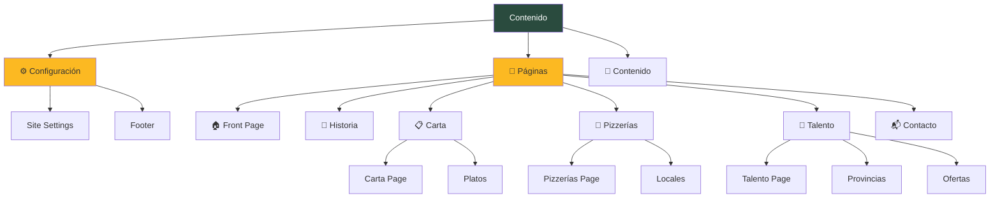

Del Poble Pizzeria uses [Sanity](https://www.sanity.io/) as its headless CMS, providing a flexible and powerful content editing experience with real-time collaboration and structured content.

## What is Sanity?

Sanity is a headless CMS that stores content in a structured format and delivers it via API. Unlike traditional CMSs, Sanity separates content management from presentation, allowing the Astro frontend to fetch and display content however needed.

<CardGroup cols={2}>
  <Card title="Structured Content" icon="database">
    Content is stored as structured data, not HTML blobs
  </Card>
  <Card title="Real-time Editing" icon="bolt">
    Multiple editors can work simultaneously with instant updates
  </Card>
  <Card title="Portable Text" icon="file-text">
    Rich text that can be rendered anywhere
  </Card>
  <Card title="Image Pipeline" icon="image">
    Automatic image optimization and CDN delivery
  </Card>
</CardGroup>

## Sanity Studio Setup

### Project Structure

```bash
delpoble-studio/
├── schemas/              # Content type definitions
│   ├── index.ts         # Schema registry
│   ├── languages.ts     # Language configuration
│   ├── localized.ts     # i18n field helpers
│   ├── frontPage.ts     # Home page schema
│   ├── cartaPage.ts     # Menu page schema
│   ├── dish.ts          # Dish content type
│   ├── local.ts         # Restaurant location
│   └── *.ts             # Other schemas
├── sanity.config.ts     # Studio configuration
├── sanity.cli.ts        # CLI configuration
└── package.json
```

### Studio Configuration

```typescript delpoble-studio/sanity.config.ts
import {defineConfig} from 'sanity'
import {structureTool} from 'sanity/structure'
import {visionTool} from '@sanity/vision'
import {schemaTypes} from './schemas'

export default defineConfig({
  name: 'default',
  title: 'Del Poble Pizzeria',

  projectId: 'v8qkjh2b',
  dataset: 'production',

  plugins: [
    structureTool({
      structure: (S) =>
        S.list()
          .title('Contenido')
          .items([
            // Custom navigation structure
            S.documentListItem()
              .title('⚙️ Configuración General')
              .schemaType('siteSettings')
              .id('siteSettings'),
            
            S.listItem()
              .title('🏠 Front Page')
              .child(
                S.document()
                  .schemaType('frontPage')
                  .documentId('frontPage')
              ),
            // ... more items
          ]),
    }),
    visionTool(), // GROQ query playground
  ],

  schema: {
    types: schemaTypes,
  },
});
```

### Running Sanity Studio

<CodeGroup>

```bash Development
cd delpoble-studio
npm run dev
# Studio available at http://localhost:3334
```

```bash Production Build
npm run build
```

</CodeGroup>

## Content Schemas

### Schema Registry

All schemas are registered in `schemas/index.ts`:

```typescript delpoble-studio/schemas/index.ts
import frontPage from './frontPage'
import cartaPage from './cartaPage'
import dish from './dish'
import local from './local'
import jobOffer from './jobOffer'
// ... more schemas

export const schemaTypes = [
  frontPage,
  cartaPage,
  dish,
  local,
  jobOffer,
  // ... all schemas
]
```

### Document Types

The project includes these main content types:

<Tabs>
  <Tab title="Pages">
    - `frontPage` - Home page (singleton)
    - `cartaPage` - Menu page (singleton)
    - `historiaPage` - History page (singleton)
    - `pizzeriasPage` - Locations page (singleton)
    - `trabajaConNosotrosPage` - Careers page (singleton)
    - `contactPage` - Contact page (singleton)
    - `generalPage` - Generic pages (multiple)
  </Tab>
  
  <Tab title="Content">
    - `dish` - Menu items
    - `local` - Restaurant locations
    - `jobOffer` - Job postings
    - `province` - Geographic provinces
  </Tab>
  
  <Tab title="Settings">
    - `siteSettings` - Global site settings (singleton)
    - `footer` - Footer content (singleton)
  </Tab>
</Tabs>

<Info>
  **Singleton** documents have a fixed ID and only one instance exists (like `frontPage`). Others can have multiple documents (like `dish`).
</Info>

## Example Schema: Front Page

Here's a simplified example of the home page schema:

```typescript delpoble-studio/schemas/frontPage.ts
import {defineField, defineType} from 'sanity'
import { localizedString, localizedText } from './localized'
import { MdHome } from 'react-icons/md'

export default defineType({
  name: 'frontPage',
  title: 'Front Page',
  type: 'document',
  icon: MdHome,
  
  groups: [
    { name: 'head', title: 'Head' },
    { name: 'sectionTwo', title: 'Section Two' },
    // ... more groups
  ],
  
  fields: [
    // Background image
    defineField({
      name: 'backgroundImages',
      title: 'Imagen de Fondo',
      type: 'object',
      group: 'head',
      fields: [
        {
          name: 'desktop',
          title: '🖥️ Desktop',
          type: 'image',
          validation: (Rule) => Rule.required(),
        },
        {
          name: 'mobile',
          title: '📱 Mobile',
          type: 'image',
        },
      ],
    }),
    
    // Localized text field
    defineField({
      ...localizedString('marqueeText', 'Texto del Marquee'),
      group: 'head',
    }),
    
    // Regular URL field
    defineField({
      name: 'orderLink',
      title: 'Link Iniciar Pedido',
      type: 'url',
      group: 'head',
      validation: (Rule) => Rule.required(),
    }),
  ],
});
```

### Field Types

<AccordionGroup>
  <Accordion title="Localized String">
    Single-line text with translations:
    ```typescript
    ...localizedString('title', 'Page Title')
    ```
    Creates tabs for ES/EN/VAL input.
  </Accordion>
  
  <Accordion title="Localized Text">
    Multi-line text with translations:
    ```typescript
    ...localizedText('description', 'Description', 6) // 6 rows
    ```
  </Accordion>
  
  <Accordion title="Image">
    Image with optional alt text:
    ```typescript
    {
      name: 'heroImage',
      type: 'image',
      options: { hotspot: true },
      fields: [
        { name: 'alt', type: 'string', title: 'Alt text' }
      ],
    }
    ```
  </Accordion>
  
  <Accordion title="Reference">
    Link to another document:
    ```typescript
    {
      name: 'dishes',
      type: 'array',
      of: [{ type: 'reference', to: [{ type: 'dish' }] }],
    }
    ```
  </Accordion>
</AccordionGroup>

## Localized Fields System

### Helper Functions

The `localized.ts` file provides helpers for creating multilingual fields:

<CodeGroup>

```typescript localizedString()
export function localizedString(
  name: string,
  title: string,
  description?: string
) {
  return {
    name,
    title,
    type: 'object',
    description,
    fieldsets: [
      {
        name: 'translations',
        title: 'Traducciones',
        options: { columns: 3 }
      }
    ],
    fields: supportedLanguages.map(lang => ({
      name: lang.id,
      title: lang.title,
      type: 'string',
      validation: (Rule: Rule) => 
        lang.isDefault ? Rule.required() : Rule.optional(),
    })),
  };
}
```

```typescript localizedText()
export function localizedText(
  name: string,
  title: string,
  rows: number,
  description?: string
) {
  return {
    name,
    title,
    type: 'object',
    fieldsets: [
      {
        name: 'translations',
        title: 'Traducciones',
        options: { columns: 1 }
      }
    ],
    fields: supportedLanguages.map(lang => ({
      name: lang.id,
      title: lang.title,
      type: 'text',
      rows,
      validation: (Rule: Rule) => 
        lang.isDefault ? Rule.required() : Rule.optional(),
    })),
  };
}
```

```typescript localizedArray()
export function localizedArray(
  name: string,
  title: string,
  ofType: any,
  description?: string
) {
  return {
    name,
    title,
    type: 'object',
    fields: supportedLanguages.map(lang => ({
      name: lang.id,
      title: lang.title,
      type: 'array',
      of: [ofType],
      validation: (Rule: Rule) => 
        lang.isDefault ? Rule.required() : Rule.optional(),
    })),
  };
}
```

</CodeGroup>

### Using Localized Fields

```typescript
import { localizedString, localizedText, localizedArray } from './localized';

fields: [
  // Simple string
  defineField({
    ...localizedString('title', 'Title'),
    group: 'content',
  }),
  
  // Long text
  defineField({
    ...localizedText('description', 'Description', 6),
    group: 'content',
  }),
  
  // Array of strings
  defineField({
    ...localizedArray('tags', 'Tags', { type: 'string' }),
    group: 'content',
  }),
]
```

## Data Structure Example

Here's how localized data is stored in Sanity:

```json
{
  "_id": "frontPage",
  "_type": "frontPage",
  "marqueeText": {
    "es": "LAS MEJORES PIZZAS DE VALENCIA",
    "en": "THE BEST PIZZAS IN VALENCIA",
    "val": "LES MILLORS PIZZES DE VALÈNCIA"
  },
  "backgroundImages": {
    "desktop": {
      "_type": "image",
      "asset": {
        "_ref": "image-abc123..."
      }
    },
    "mobile": {
      "_type": "image",
      "asset": {
        "_ref": "image-def456..."
      }
    }
  },
  "orderLink": "https://order.delpoble.com"
}
```

## Querying Content

### Sanity Client

The Astro app connects to Sanity via the client:

```typescript src/lib/sanity.ts
import { createClient } from '@sanity/client';

export const client = createClient({
  projectId: 'v8qkjh2b',
  dataset: 'production',
  useCdn: true,
  apiVersion: '2024-01-01',
});
```

### GROQ Query Language

Sanity uses [GROQ](https://www.sanity.io/docs/groq) (Graph-Relational Object Queries):

```groq
*[_type == "frontPage"][0] {
  "marqueeText": coalesce(marqueeText.en, marqueeText.es, ""),
  backgroundImages,
  orderLink
}
```

**GROQ Syntax:**
- `*[_type == "frontPage"]` - Get all documents of type frontPage
- `[0]` - Get the first result
- `{ ... }` - Project specific fields
- `coalesce(a, b, c)` - Return first non-null value

### Query Helpers

Query helpers simplify localized content fetching:

```typescript src/lib/sanityQueries.ts
export function localizedField(fieldName: string, lang: string = 'es') {
  return `"${fieldName}": coalesce(${fieldName}.${lang}, ${fieldName}.es, "")`;
}

export function getFrontPageQuery(lang: string = 'es') {
  return `
    *[_type == "frontPage" && _id == "frontPage"][0] {
      backgroundImages,
      orderLink,
      ${localizedField('marqueeText', lang)},
      ${localizedField('bodyText', lang)}
    }
  `;
}
```

### Fetching in Astro Pages

```astro src/pages/index.astro
---
import { client } from '../lib/sanity';
import { getFrontPageQuery } from '../lib/sanityQueries';
import { getLangFromUrl } from '../i18n/utils';

const lang = getLangFromUrl(Astro.url);
const frontPageData = await client.fetch(getFrontPageQuery(lang));
---

<h1>{frontPageData.marqueeText}</h1>
```

## Custom Navigation Structure

The Studio sidebar is customized for better organization:



This structure is defined in `sanity.config.ts` using the `structureTool` plugin.

## Image Handling

### Image Fields

Images include optional alt text and hotspot:

```typescript
{
  name: 'heroImage',
  type: 'image',
  options: {
    hotspot: true, // Enable focal point selection
  },
  fields: [
    {
      name: 'alt',
      type: 'string',
      title: 'Alt text',
    },
  ],
}
```

### Querying Images

Images are queried with their asset reference:

```groq
{
  "heroImage": heroImage.asset->url,
  "heroImageAlt": heroImage.alt
}
```

### Image URLs

Sanity provides automatic image optimization:

```typescript
import imageUrlBuilder from '@sanity/image-url';
import { client } from './sanity';

const builder = imageUrlBuilder(client);

function urlFor(source) {
  return builder.image(source);
}

// Usage
const imageUrl = urlFor(heroImage)
  .width(800)
  .height(600)
  .format('webp')
  .url();
```

## Content Relationships

### References

Documents can reference other documents:

```typescript
// In cartaPage schema
{
  name: 'dishes',
  type: 'array',
  of: [
    {
      type: 'reference',
      to: [{ type: 'dish' }]
    }
  ],
}
```

### Dereferencing in Queries

Use `->` to expand references:

```groq
*[_type == "cartaPage"][0] {
  "dishes": dishes[]-> {
    _id,
    name,
    description,
    price
  }
}
```

## Vision Tool

The **Vision** plugin provides a query playground in Studio:

<Steps>
  <Step title="Open Vision">
    Click "Vision" in the Studio sidebar
  </Step>
  <Step title="Write GROQ query">
    ```groq
    *[_type == "dish"][0..5] {
      name,
      price
    }
    ```
  </Step>
  <Step title="Execute">
    Click "Execute" to see results
  </Step>
  <Step title="Refine">
    Iterate on your query until you get the desired data structure
  </Step>
</Steps>

<Tip>
  Use Vision to test queries before adding them to your code!
</Tip>

## Best Practices

<CardGroup cols={2}>
  <Card title="Use helpers" icon="code">
    Always use `localizedString()`, `localizedText()`, etc. for consistency
  </Card>
  <Card title="Validate required fields" icon="check">
    Mark critical fields as required to prevent empty content
  </Card>
  <Card title="Group related fields" icon="layer-group">
    Use groups to organize complex schemas (head, content, SEO, etc.)
  </Card>
  <Card title="Add descriptions" icon="info-circle">
    Add field descriptions to help editors understand what to enter
  </Card>
</CardGroup>

## Common Patterns

### Singleton Documents

Pages with a fixed ID:

```typescript
// In Studio structure
S.listItem()
  .title('🏠 Front Page')
  .child(
    S.document()
      .schemaType('frontPage')
      .documentId('frontPage') // Fixed ID
  )
```

### Ordered Lists

Content with manual ordering:

```typescript
fields: [
  {
    name: 'order',
    title: 'Order',
    type: 'number',
    validation: (Rule) => Rule.required(),
  },
]
```

Query with ordering:

```groq
*[_type == "dish"] | order(order asc)
```

### Conditional Fields

Show fields based on other field values:

```typescript
{
  name: 'showDescription',
  type: 'boolean',
},
{
  name: 'description',
  type: 'text',
  hidden: ({ document }) => !document?.showDescription,
}
```

## Troubleshooting

<AccordionGroup>
  <Accordion title="Schema changes not appearing">
    **Solution**: Restart Sanity Studio with `npm run dev` in `delpoble-studio/`
  </Accordion>
  
  <Accordion title="TypeScript errors in schemas">
    **Solution**: Ensure you're using `defineField()` and `defineType()` from the `sanity` package
  </Accordion>
  
  <Accordion title="Images not loading">
    **Solution**: Check that the image asset reference is being expanded with `->url` in your GROQ query
  </Accordion>
  
  <Accordion title="Query returns null">
    **Solution**: 
    1. Use the Vision tool to test the query
    2. Check that documents exist with that type
    3. Verify field names match exactly (case-sensitive)
  </Accordion>
</AccordionGroup>

## Related Documentation

<CardGroup cols={2}>
  <Card title="Architecture" icon="sitemap" href="/concepts/architecture">
    How Sanity integrates with Astro SSR
  </Card>
  <Card title="Internationalization" icon="globe" href="/concepts/internationalization">
    Understanding the i18n system
  </Card>
  <Card title="Sanity Docs" icon="book" href="https://www.sanity.io/docs">
    Official Sanity documentation
  </Card>
  <Card title="GROQ Reference" icon="code" href="https://www.sanity.io/docs/groq">
    Complete GROQ query language reference
  </Card>
</CardGroup>
